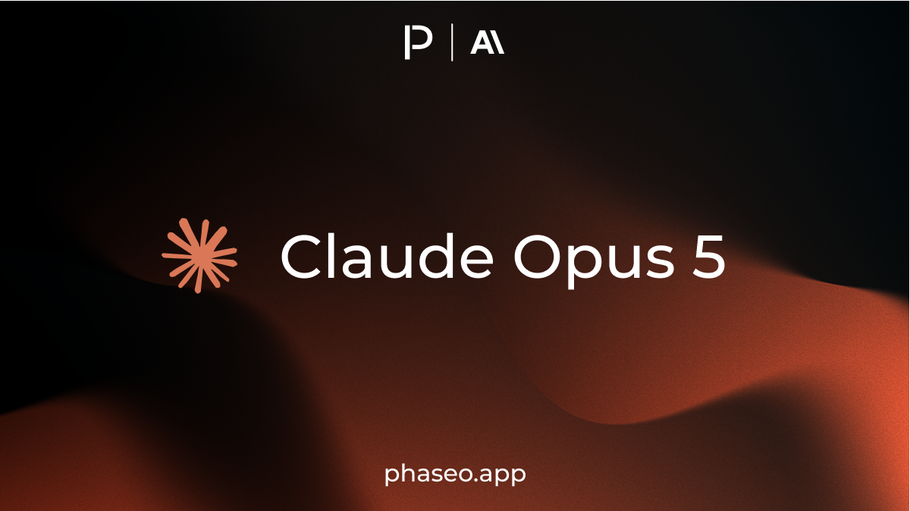
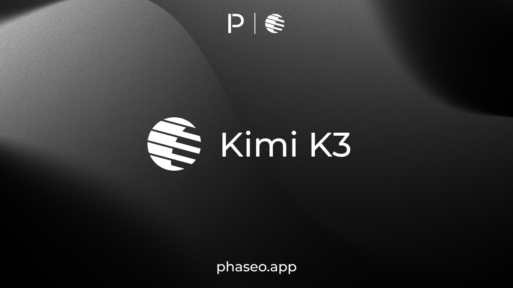
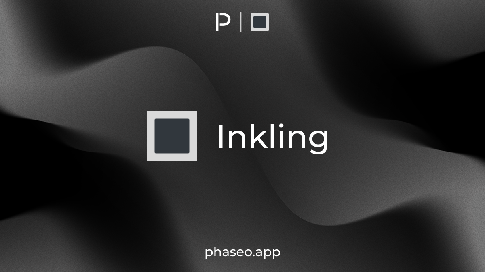
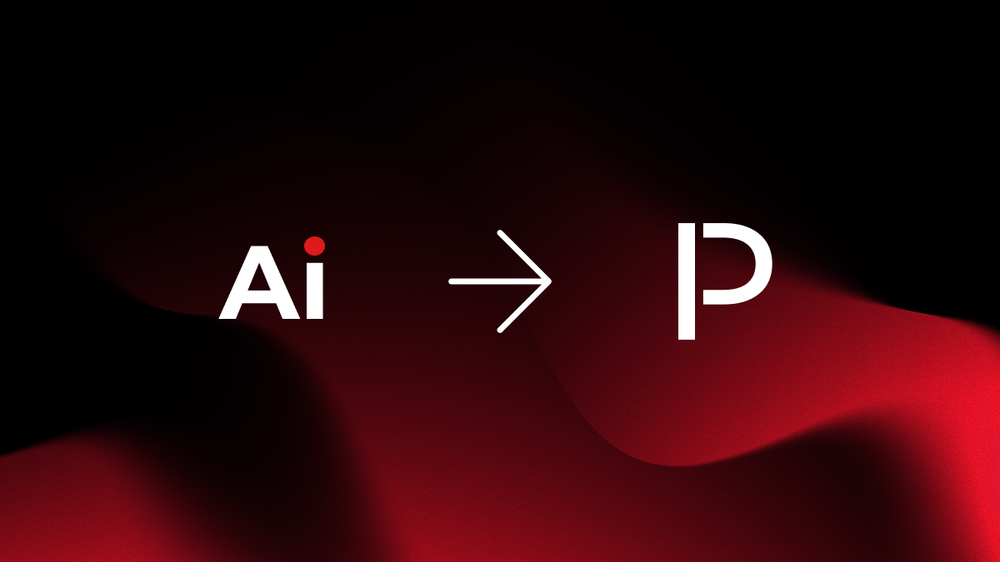
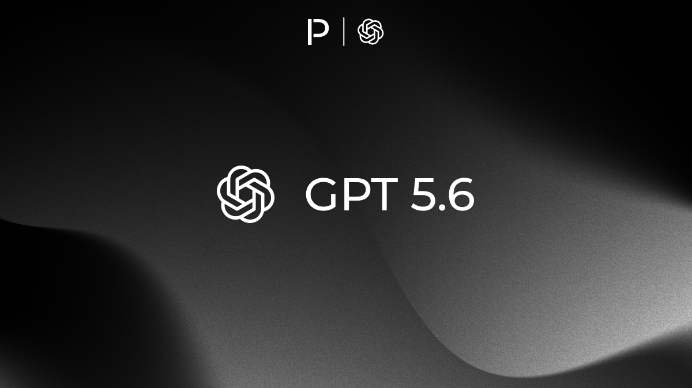
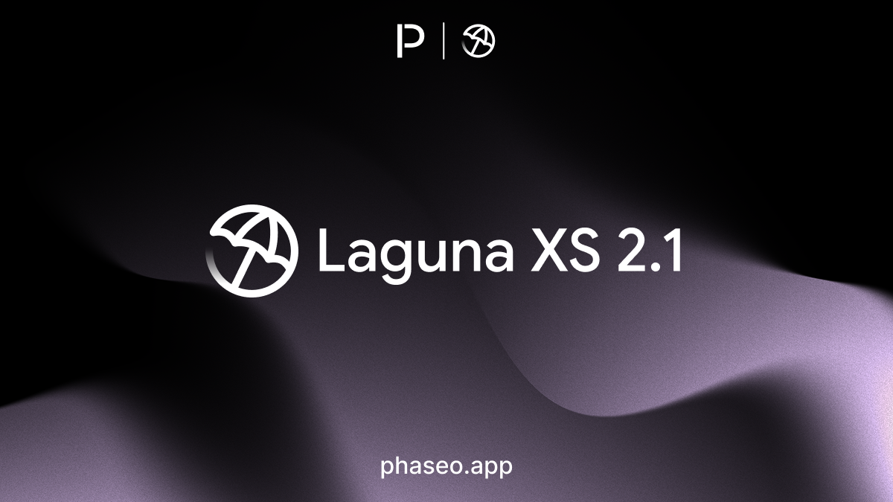

<Update label="July 24, 2026" tags={["Model Releases","Provider Coverage","Pricing"]}>

### Model Releases

- [Anthropic: Claude Opus 5](https://phaseo.app/models/anthropic/claude-opus-5)

</Update>

<Update label="July 20, 2026" tags={["Features"]}>

- Model pages are now easier to discover in search.

</Update>

<Update label="July 19, 2026" tags={["Features","Model Releases"]}>

### Features

- Improved search discovery across Phaseo and its documentation.

### Model Releases

- [Poolside: Laguna S 2.1](https://phaseo.app/models/poolside/laguna-s-2.1)
- [Qwen: Qwen3.8 Max Preview](https://phaseo.app/models/qwen/qwen3.8-max-preview)

</Update>

<Update label="July 17, 2026" tags={["Features"]}>

### Features

- Authenticated MCP is now available.
- Benchmark rankings now account for ties more consistently.

</Update>

<Update label="July 16, 2026" tags={["Features","Model Releases"]}>

### Features

- Passkeys are now available to all users for passwordless sign-in and account management with device biometrics, PINs, or security keys.
- Chat model selection is faster and works correctly when starting a new chat.

### Model Releases

- [Moonshot AI: Kimi K3](https://phaseo.app/models/moonshotai/kimi-k3)

</Update>

<Update label="July 15, 2026" tags={["Model Releases"]}>

- [Thinking Machines: Inkling](https://phaseo.app/models/thinking-machines/inkling)
- [Thinking Machines: Inkling 64K](https://phaseo.app/models/thinking-machines/inkling-64k)
- [Thinking Machines: Inkling Small](https://phaseo.app/models/thinking-machines/inkling-small)

</Update>

<Update label="July 9, 2026" tags={["Features","Model Releases","Docs","Branding","Migration"]}>

### Features

- AI Stats is now Phaseo across the product, documentation, SDK examples, and public site. Read the migration announcement in [AI Stats is becoming Phaseo](https://phaseo.app/blog/phaseo-migration-2026-07-06).
- New developer-facing examples use Phaseo naming and `PHASEO_*` configuration while existing deployments can keep their current environment-variable names.
- The blog and announcement surfaces were refreshed for the rebrand, including the new migration announcement layout and launch imagery.
- Local, preview, and production builds now use distinct favicons so active environments are easier to tell apart while testing.
- Dropdown menus and tab selectors now use Base UI render composition consistently across chat, settings, usage, rankings, and data screens ([PR #938](https://github.com/phaseoteam/Phaseo/pull/938)).
- The OpenAI GPT-5.6 migration guide was added for Sol, Terra, and Luna readiness planning.
- Model links now store human-readable titles alongside link kinds and preserve multiple links of the same kind.
- Amazon Bedrock provider coverage was staged for SpaceXAI Grok 4.3 with Bedrock Mantle model id `xai.grok-4.3`, standard pricing, and current `us-west-2` in-region availability. The provider-model capability is currently disabled pending setup. AWS currently lists Grok 4.3 as the only SpaceXAI model on Bedrock, and does not list Geo or Global inference for it.
- Amazon Bedrock OpenAI frontier model coverage was checked; AWS still documents GPT-5.5 and GPT-5.4 as regional/Geo in-region offerings, with Global cross-region pricing marked as coming soon.

### Model Releases

- [OpenAI: GPT 5.6 Sol](https://phaseo.app/models/openai/gpt-5.6-sol)
- [OpenAI: GPT 5.6 Terra](https://phaseo.app/models/openai/gpt-5.6-terra)
- [OpenAI: GPT 5.6 Luna](https://phaseo.app/models/openai/gpt-5.6-luna)
- Muse Spark 1.1 was added with Meta Model API preview metadata, 1M context, benchmark coverage, and titled announcement/API links.

</Update>

<Update label="July 8, 2026" tags={["Model Releases"]}>

### Model Releases

- [OpenAI: GPT Live 1](https://phaseo.app/models/openai/gpt-live-1)
- [OpenAI: GPT Live 1 Mini](https://phaseo.app/models/openai/gpt-live-1-mini)
- [SpaceXAI: Grok 4.5](https://phaseo.app/models/spacex-ai/grok-4.5)
- [KwaiPilot: Kat Coder Air V2.5](https://phaseo.app/models/kwaipilot/kat-coder-air-v2.5)
- [KwaiPilot: Kat Coder Pro V2.5](https://phaseo.app/models/kwaipilot/kat-coder-pro-v2.5)

</Update>

<Update label="July 7, 2026" tags={["Features","Model Releases"]}>

### Features

- Chat now surfaces clearer timing and tool metadata, audio attachments, model-picker focus handling, tag management, and account credit display ([PR #922](https://github.com/phaseoteam/Phaseo/pull/922)).
- Header search now lazy-loads a compact cached index only when opened, reducing normal dashboard payloads ([PR #920](https://github.com/phaseoteam/Phaseo/pull/920)).
- Chat streaming, tool-call continuation, and model catalogue cache refresh paths were hardened for more reliable server-tool turns and model pages ([PR #919](https://github.com/phaseoteam/Phaseo/pull/919), [PR #918](https://github.com/phaseoteam/Phaseo/pull/918)).
- API key reveal flows, internal navigation, and new-model Discord notifications were tightened for cleaner settings, admin, and release workflows ([PR #812](https://github.com/phaseoteam/Phaseo/pull/812), [PR #925](https://github.com/phaseoteam/Phaseo/pull/925), [PR #927](https://github.com/phaseoteam/Phaseo/pull/927)).
- SiliconFlow provider coverage was added for Tencent Hy3, including the free route and current pricing.
- xAI catalogue and provider labels were renamed to SpaceXAI across model pages, provider records, aliases, logos, and generated SDK/OpenAPI surfaces.
- Aion 1.0 and Aion 1.0 Mini were marked deprecated and retired on July 4, 2026 after Aion Labs removed them from the live model endpoint.

### Model Releases

- [Aion Labs: Aion 3.0](https://phaseo.app/models/aion-labs/aion-3.0)
- [Aion Labs: Aion 3.0 Mini](https://phaseo.app/models/aion-labs/aion-3.0-mini)
- [Meta: Muse Image](https://phaseo.app/models/meta/muse-image)
- [Meta: Muse Video](https://phaseo.app/models/meta/muse-video)
- [Sakana: Fugu](https://phaseo.app/models/sakana/fugu)
- [Sakana: Fugu Ultra](https://phaseo.app/models/sakana/fugu-ultra)
- [Tencent: Hy3](https://phaseo.app/models/tencent/hy3)
- Microsoft MAI and Phi catalog entries

</Update>

<Update label="July 6, 2026" tags={["Model Releases","Provider Coverage","Pricing"]}>

### Model Releases

- [OpenAI: GPT Realtime 2.1](https://phaseo.app/models/openai/gpt-realtime-2.1)
- [OpenAI: GPT Realtime 2.1 Mini](https://phaseo.app/models/openai/gpt-realtime-2.1-mini)
- [Tencent: Hy3](https://phaseo.app/models/tencent/hy3)

### Provider Coverage

- Amazon Bedrock Mantle was split into its own provider catalogue with model coverage and pricing for Anthropic, Google, MiniMax, MoonshotAI, NVIDIA, OpenAI, Qwen, SpaceXAI, and Z.AI models.
- AtlasCloud and Novita provider coverage was added for Tencent Hy3, including free-route pricing where available.
- Groq Qwen 3.6 gateway routing was disabled until provider pricing is available.

### Pricing

- DeepSeek V4 Flash and DeepSeek V4 Pro pricing now supports time-windowed provider rates.

</Update>

<Update label="July 5, 2026" tags={["Features"]}>

### Features

- Server-tool inputs, monitor history links, workspace credit cache invalidation, and pricing edge cases were hardened across gateway and web surfaces ([PR #900](https://github.com/phaseoteam/Phaseo/pull/900)).
- Chat gateway target resolution now fails closed in production when the configured gateway URL is missing, while preserving local-development overrides ([PR #899](https://github.com/phaseoteam/Phaseo/pull/899)).
- Anthropic and Bedrock request shaping now uses adaptive thinking controls for Claude Sonnet 5 and newer Opus 4.x models ([PR #901](https://github.com/phaseoteam/Phaseo/pull/901)).
- Server-tool handling was hardened for datetime, web fetch, web search, image generation, and fusion workflows.
- Monitor links now apply stricter URL safety checks.
- GMICloud MiniMax M3 cached-read pricing and Google Vertex Gemini 3.1 Flash-Lite Image pricing validation were tightened.

</Update>

<Update label="July 4, 2026" tags={["Features"]}>

### Features

- Chat shortcuts, prompt queue controls, composer tool configuration, restored tags, bulk editing, and richer response timing metadata shipped together for the chat workspace ([PR #896](https://github.com/phaseoteam/Phaseo/pull/896)).

</Update>

<Update label="July 3, 2026" tags={["Features"]}>

### Features

- Individual model pages were overhauled with clearer lifecycle notices, restored routing details, and better handoffs from model pages into gateway workflows ([PR #888](https://github.com/phaseoteam/Phaseo/pull/888)).
- Retired and replaced model pages now make status, alternatives, and historical context easier to scan without burying the current model link ([PR #888](https://github.com/phaseoteam/Phaseo/pull/888)).
- Chat tags, tool-call markers, API target controls, and mobile viewport handling were restored or tightened across the chat experience ([PR #894](https://github.com/phaseoteam/Phaseo/pull/894), [PR #895](https://github.com/phaseoteam/Phaseo/pull/895), [PR #891](https://github.com/phaseoteam/Phaseo/pull/891)).

</Update>

<Update label="July 2, 2026" tags={["Features","Model Releases"]}>

### Features

- Core interactive UI primitives moved onto Base UI, improving accessibility and behaviour consistency across filters, menus, dialogs, and model controls ([PR #854](https://github.com/phaseoteam/Phaseo/pull/854)).
- Chat and settings flows received follow-up polish after the Base UI migration, including steadier model pickers and cleaner menu spacing ([PR #853](https://github.com/phaseoteam/Phaseo/pull/853)).

### Model Releases

- [Poolside: Laguna XS 2.1](https://phaseo.app/models/poolside/laguna-xs-2.1)

</Update>

<Update label="July 1, 2026" tags={["Model Releases"]}>

### Model Releases

- [Anthropic: Claude Fable 5](https://phaseo.app/models/anthropic/claude-fable-5)

</Update>
