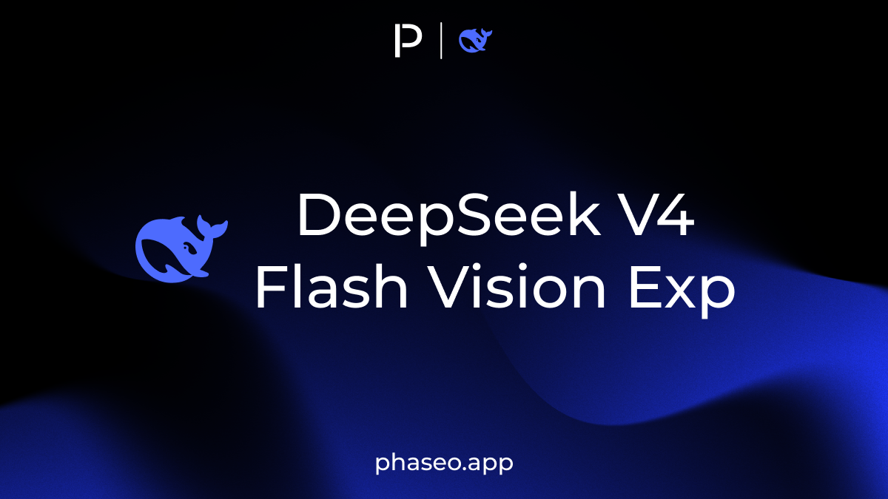
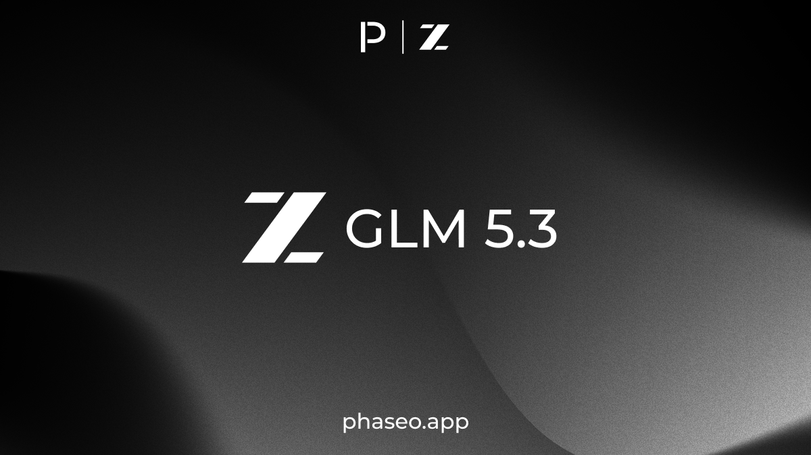
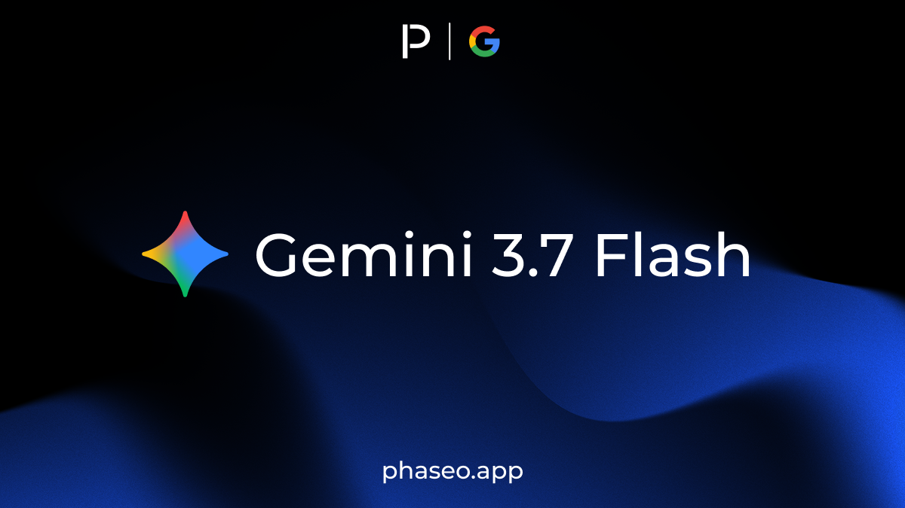
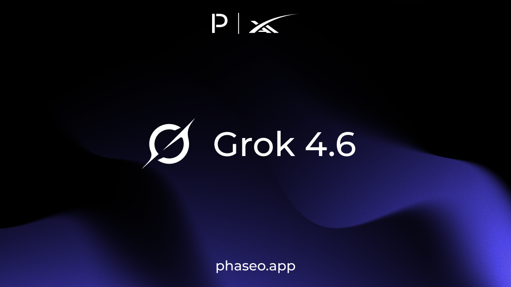
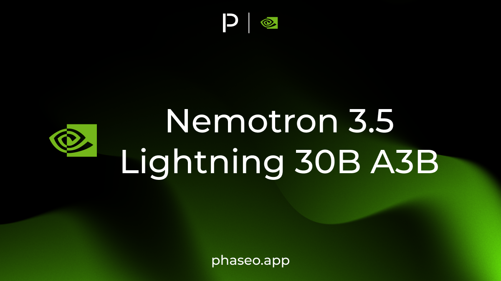
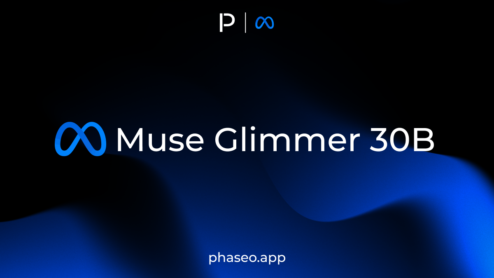
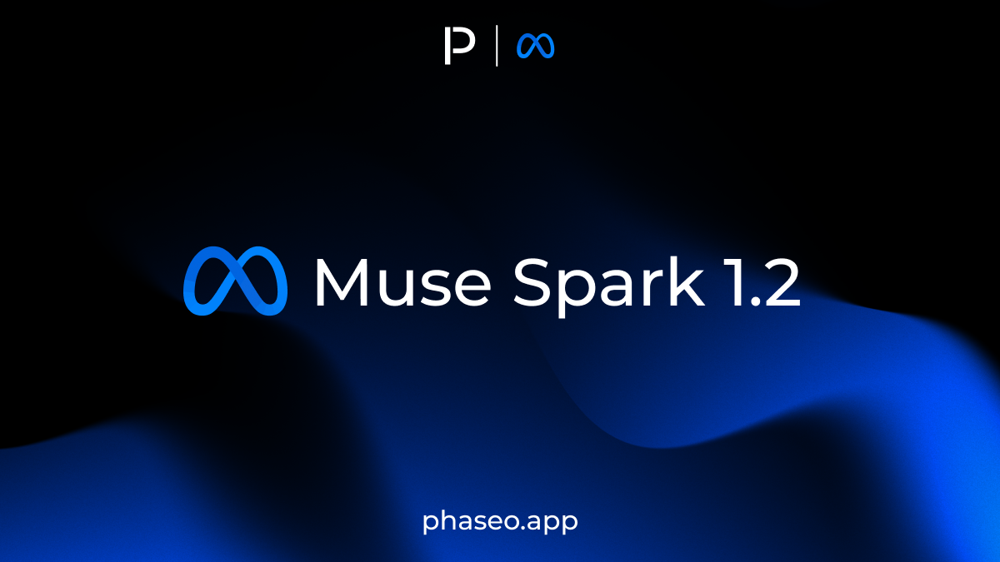
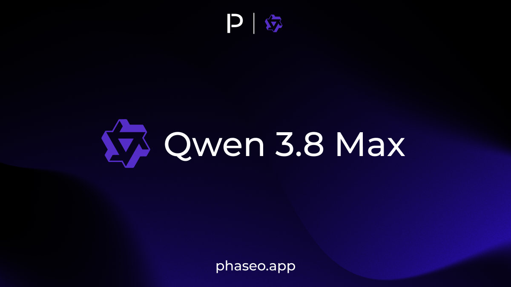

<Update label="August 23, 2026" tags={["Platform"]}>

### Workspace administration

- Added self-service Enterprise workspace add-ons for SSO, SCIM, directory management, and departments.
- Added workspace notification destinations for email, Discord, Slack, Microsoft Teams, and custom HTTPS webhooks.
- Added app-category attribution through `X-App-Categories` and the TypeScript SDK.

</Update>

<Update label="August 21, 2026" tags={["Model Releases"]}>

### Model Releases

- [DeepSeek V4 Flash Vision Exp](https://phaseo.app/models/deepseek/deepseek-v4-flash-vision-exp)

</Update>

<Update label="August 14, 2026" tags={["Model Releases"]}>

### Model Releases

- [GLM 5.3](https://phaseo.app/models/z-ai/glm-5.3)
- [Qwen 3.8 27B](https://phaseo.app/models/qwen/qwen3.8-27b)

</Update>

<Update label="August 13, 2026" tags={["Model Releases"]}>

### Model Releases

- [Gemini 3.7 Flash](https://phaseo.app/models/google/gemini-3.7-flash)
- [OCR 4.1](https://phaseo.app/models/mistral/ocr-4.1)
- [DeepSeek V4 Pro 0813](https://phaseo.app/models/deepseek/deepseek-v4-pro-0813)

</Update>

<Update label="August 12, 2026" tags={["Model Releases"]}>

### Model Releases

- [Grok 4.6](https://phaseo.app/models/spacex-ai/grok-4.6)

</Update>

<Update label="August 11, 2026" tags={["Model Releases"]}>

### Model Releases

- [MAI Code 1.1 Flash](https://phaseo.app/models/microsoft/mai-code-1.1-flash)
- [Nemotron 3.5 Lightning 30B A3B](https://phaseo.app/models/nvidia/nemotron-3.5-lightning)
- [Grok Imagine Image 2.0](https://phaseo.app/models/spacex-ai/grok-imagine-image-2.0)

</Update>

<Update label="August 10, 2026" tags={["Model Releases"]}>

### Model Releases

- [Muse Glimmer 30B](https://phaseo.app/models/meta/muse-glimmer-30b)

</Update>

<Update label="August 7, 2026" tags={["Model Releases"]}>

### Model Releases

- [Seedance 2.5](https://phaseo.app/models/bytedance/seedance-2.5)

</Update>

<Update label="August 6, 2026" tags={["Model Releases"]}>

### Model Releases

- [Solar Pro 4](https://phaseo.app/models/upstage/solar-pro-4)

</Update>

<Update label="August 5, 2026" tags={["Model Releases"]}>

### Model Releases

- [Ling 3.0 Tiny](https://phaseo.app/models/inclusionai/ling-3.0-tiny)
- [Muse Spark 1.2](https://phaseo.app/models/meta/muse-spark-1.2)
- [Muse Spark 1.2 Contributor](https://phaseo.app/models/meta/muse-spark-1.2-contributor)
- [Shieldstral 1.0 3B](https://phaseo.app/models/mistral/shieldstral-1.0-3b)

</Update>

<Update label="August 3, 2026" tags={["Model Releases"]}>

### Model Releases

- [Qwen 3.8 Max](https://phaseo.app/models/qwen/qwen3.8-max)
- [Namazu](https://phaseo.app/models/sakana/namazu)

</Update>
